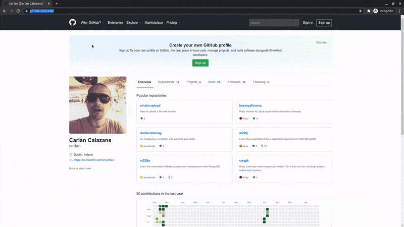

<h1 align="center">
    
</h1>

# 🤒 Coronavirus map 🤒

A full stack application to show information about the Coronavirus areas affected near you.

<h1 align="center">
    
</h1>

## 📃 TODO:

- [ ] Setup client
    - [x] Create a React application
    - [x] install setup linter
    - [x] Grab sample data from a json file
    - [x] Add a map
        - [x] Let user use own location
        - [x] Display fullscreen
        - [x] Add map controls for zoom in and out
    - [x] Show a pin on locations affected
        - [x] Add popup with more information in case pin is clicked
    - [ ] Create a dashboard view
    - [ ] Split app in components
    - [ ] Update README.md
- [ ] Setup server
    - [x] Create a Node.js application
        - [x] Install dependencies
        - [x] install setup linter
        - [x] Setup express application
        - [x] Setup middlewares for error handling
    - [x] Add route to scrape the data
        - [x] Update user-agent on each request
        - [x] Add latitude and logitude to the data scraped
    - [ ] Split application in files controllers, service, utils
    - [ ] Update README.md
- [x] Update README.md to add gif of application working
- [ ] Create Docker config
- [ ] Host it
- [ ] Clean up README.md

## 🏁 Getting Started

These instructions will get you a copy of the project up and running on your local machine for development and testing purposes. See deployment for notes on how to deploy the project on a live system.

### 📜 Prerequisites

* Get a TOKEN for the map [here](http://www.mapbox.com)
* Place your TOKEN on `.env` configuration file. See below.

### ⏳ Installing

To get the development environment running you'll need to follow the steps below.

Install the dependencies of client and run the application:

```bash
$ cd client
$ npm install <OR> yarn install
$ npm start <OR> yarn start
```

Install the dependencies of client and run the application:

```bash
$ cd server
$ npm install <OR> yarn install
$ npm start <OR> yarn start
```

Add the TOKEN on the enviroment configuration file:

```bash
$ cp .env.sample .env
Edit the file (.env) in your prefered editor and place your TOKEN on REACT_APP_MapboxAccessToken=<HERE>
```

Opening the application on http://localhost:3000 you should be able to see a map with the affected locations of Coronavirus along with some case information for each region/country and map view options.

## 👷 Built With

* [React](https://reactjs.org)
* [Node.JS](https://nodejs.org)
* Planning to add more

## 👨‍💻 Authors

* **Carlan Calazans** - *Initial work* - [carlan](https://github.com/carlan)

## 📙 License

This project is licensed under the MIT License - see the [LICENSE.md](LICENSE.md) file for details

## 🤝 Acknowledgments

* favicon and logo image from [OpenClipart](https://openclipart.org)